# projet_kayu

Lien pour télécharger le fichier d'installation : <a href="https://drive.google.com/file/d/1fn6Zq60gCINYtryhggMWP8Mb85Udhljo/view?usp=sharing">apk</a>

## Context du projet :
Créer une application mobile qui doit fonctionner au minimum sur Android 4. Cette application s'appelle "KAYU". Elle doit, comme le permet l'application mobile "YUKA", 
posséder au minimum deux fonctionnalités indispensables qui sont :
* scanner un code barre au format EAN-13
* afficher les informations du produit scanné (nutri-score, les ingrédients, les nutriments, le nom du produit, dans quels magasins on peut le trouver, etc)

KAYU aura à sa disposition une base de données embarquée SQLite qui va stocker les informations des produits scannées. Donc, un historique 
des produits scannés devra être visible dans l'application.

Dès que l'utilisateur a scanné un produit, l'application devra aller requêter l'API d'Open Food Facts pour récupérer les informations du produit.

## Technos utilisées :
* IDE : Android Studio
* API REST
* SQLite
* Languages de programmation utilisés : JAVA

## Des screenshoots de l'application :
### Installation de l'application :
* lorsque vous allez installer l'application, des messages de "Play Protect" vont apparaitre à l'écran, vous devrez les ignorer. En effet, "Play Protect" va vous demander si vous voulez quand même installer l'appli à cause du fait que mon appli n'a pas été signé avec la signature d'application "Google Play". 

Voici les différents messages que vous aurez pendant son installation : 

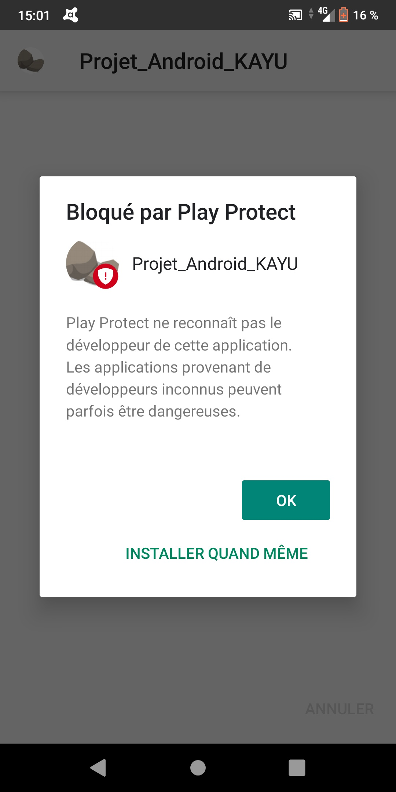  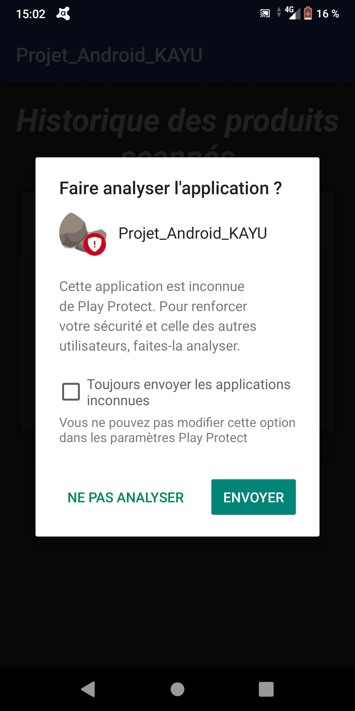

### Interface d'accueil :
* lorsque vous lancez l'application, si l'application n'a pas les droits d'accès à la caméra vous aurez cette interface :

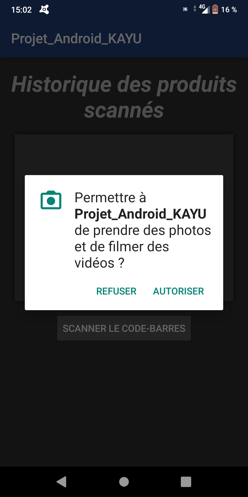

Donc, lorsque vous accéderez à l'interface pour scanner votre code barre, vous aurez cette affichage :

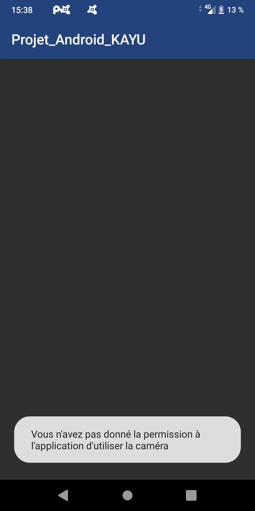

Pour pouvoir activer les droits, soit vous allez dans les paramètres du téléphone ou vous fermez l'application avec le bouton "back" et la relancer pour pouvoir avoir de nouveau la pop-up.

Remarques : dans le apk que vous pouvez télécharger avec le lien qui se trouve au début du Readme, il y aura dans la pop-up une faute d'orthographe sur le mot "donné" parce que je l'avais écrit avec "er" sans faire attention et vu que je n'ai pas encore regénéré le fichier apk, il y aura la faute d'orthographe.

* sinon vous aurez cet affichage :
  - avec un historique vide :
  
  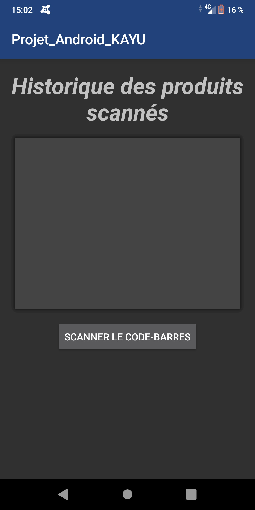
  
  - avec un historique remplit : 
  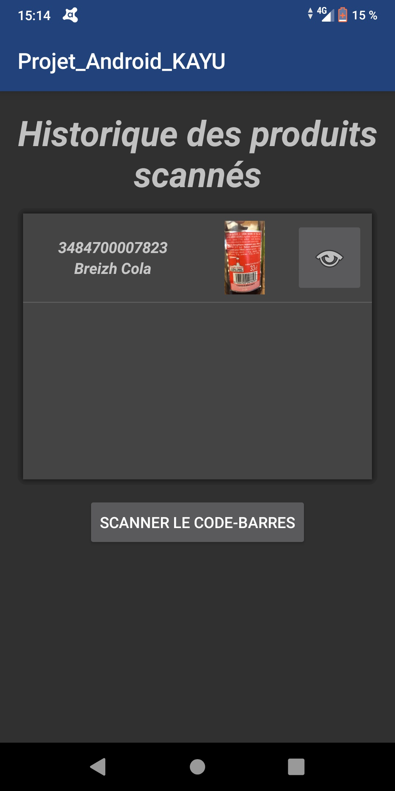
  
### Interface qui permet de scanner un code barre :
* sans la pop-up qui permet de saisir à la main le code barre :

  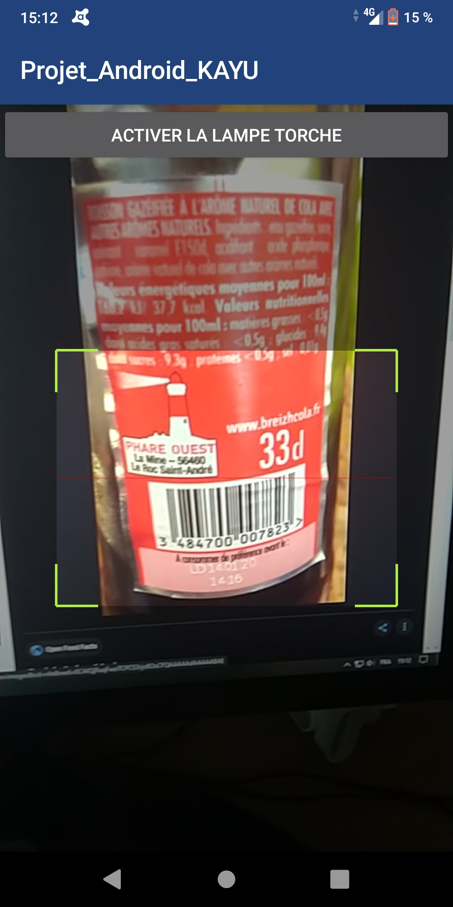
  
* si vous n'avez pas réussi à scanner votre code barre au bout de 6 sec il affichera la pop-up :

  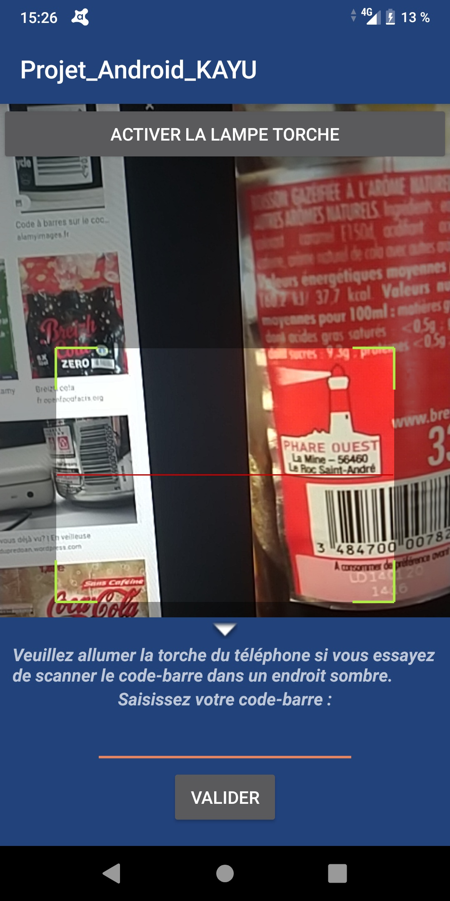
  
### Interface qui affiche les informations du produit scanné :
* soit le produit n'existe pas dans la base de données d'Open Food Facts :

  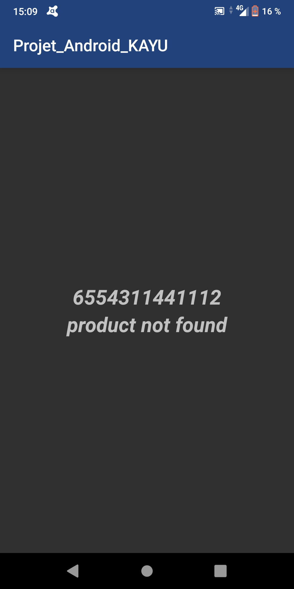

* sinon il affiche les informations du produits :

  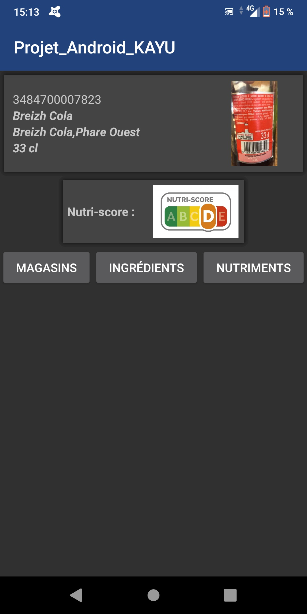
  
  - l'affichage des nutriments :
  
  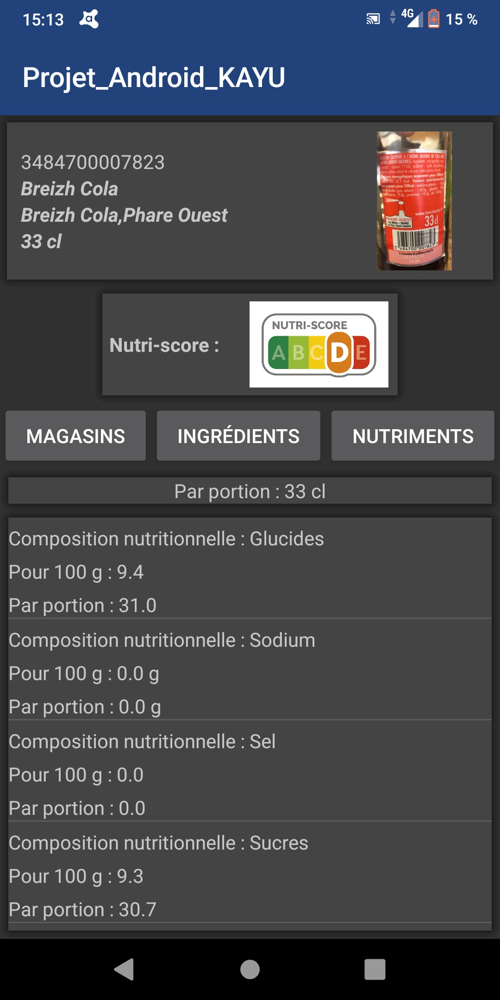
  
  - etc ...
  
 ### Remarque :
 Si à un moment donné, l'application a besoin d'internet, il vous affichera cette pop-up :
 
 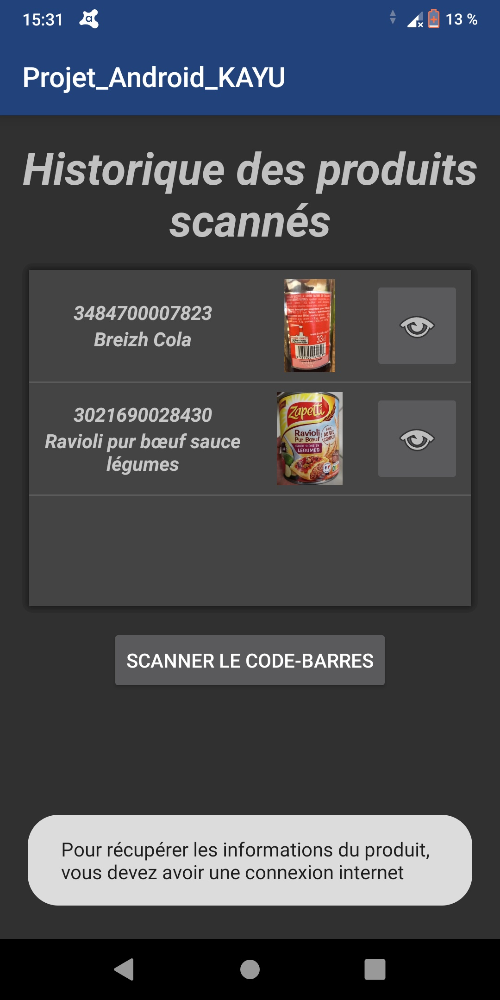
 
